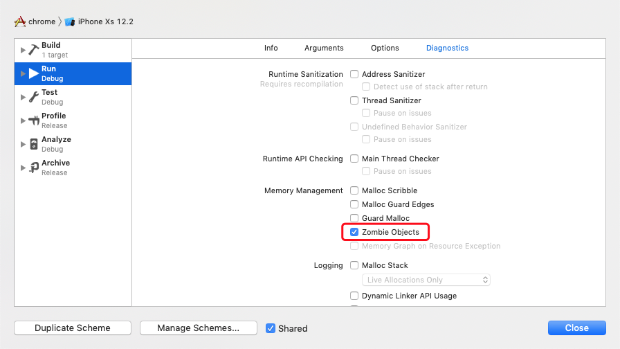
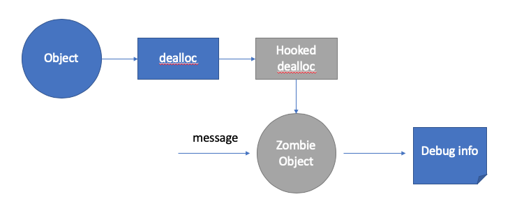

# 跟着 chromium 学写代码：Zombie Object

## 什么是 Zombie Object
做 `iOS` 开发的一定对 `Zombie Object` 多少有些了解。当一个 `Objective-C` 对象已释放后，再试图发送消息给这个对象，就会发生 `crash` 或者其它一些奇怪的事情。`Zombie Object` 主要用于定位这种野指针问题。`Xcode` 就自带了 `Zombie Objects` 的功能，在 `Edit Scheme -> Run -> Diagonostics` 中可以开启。



## Zombie Object 的原理
`Zombie Object` 的原理不难理解。当一个对象引用计数为 `0`，并调用 `dealloc` 时，并不真正释放这个对象，而是将这个对象篡改为一个 `Zombie Object`。再试图给这个对象发送消息时，实际响应这个消息的是篡改后的 `Zombie Object`。`Zombie Object` 会记录原始对象的类型等信息，对它发送任何消息，都会打印出其记录的原始对象的信息。根据这些信息，就可以快速定位到问题的具体原因。



## chromium 是怎么实现 Zombie Object 的？
在 `chromium for iOS` 的源代码中也有 `Zombie Object` 的实现 [`objc_zombie`](https://chromium.googlesource.com/chromium/src/+/d2b44bd628c85b8d7150a533b6c8a6b857211aa8/chrome/browser/cocoa/objc_zombie.mm)。下面主要看下它的实现中的几个关键点：

### 1. `CrZombie` 和 `CrFatZombie`

首先，`chromium` 将 `Zombie Object` 的类型定义为 `CrZombie` 和 `CrFatZombie`。
```objc
// Deallocated objects are re-classed as |CrZombie|.  No superclass
// because then the class would have to override many/most of the
// inherited methods (|NSObject| is like a category magnet!).
// Without the __attribute__, clang's -Wobjc-root-class warns on the missing
// superclass.
__attribute__((objc_root_class))
@interface CrZombie  {
  Class isa;
}
@end

// Objects with enough space are made into "fat" zombies, which
// directly remember which class they were until reallocated.
@interface CrFatZombie : CrZombie {
 @public
  Class wasa;
}
@end
``` 
这里有两个有意思的点：

* `__attribute__((objc_root_class))` 修饰 `CrZombie`，声明了一个纯粹的类型，没有继承 `NSObject` 或者其他任何父类。这样，`CrZombie` 就默认没有任何方法，仅需实现几个必要的方法来响应消息即可。

```objc
@implementation CrZombie

// The Objective-C runtime needs to be able to call this successfully.
+ (void)initialize {
}

// Any method not explicitly defined will end up here, forcing a
// crash.
- (id)forwardingTargetForSelector:(SEL)aSelector {
    ZombieObjectCrash(self, aSelector, NULL);
    return nil;
}

// Override a few methods often used for dynamic dispatch to log the
// message the caller is attempting to send, rather than the utility
// method being used to send it.
- (BOOL)respondsToSelector:(SEL)aSelector {
    ZombieObjectCrash(self, aSelector, _cmd);
    return NO;
}

- (id)performSelector:(SEL)aSelector {
    ZombieObjectCrash(self, aSelector, _cmd);
    return nil;
}

- (id)performSelector:(SEL)aSelector withObject:(id)anObject {
    ZombieObjectCrash(self, aSelector, _cmd);
    return nil;
}

- (id)performSelector:(SEL)aSelector
        withObject:(id)anObject
        withObject:(id)anotherObject {
    ZombieObjectCrash(self, aSelector, _cmd);
    return nil;
}

- (void)performSelector:(SEL)aSelector
            withObject:(id)anArgument
            afterDelay:(NSTimeInterval)delay {
    ZombieObjectCrash(self, aSelector, _cmd);
}

@end
```

* `CrFatZombie`，对于大小大于等于 `sizeof(Class) * 2`的实例对象，其 `dealloc` 时，会将篡改的 `Zombie Object` 的类型指定为 `CrFatZombie`。其多出的一个 `isa` 用于指向该对象原本的类型。

    对于这点我有些疑惑。`Xcode` 的 `Zombie Objects` 会将已释放的对象类型篡改为 `_NSZombie_XXX`，其中 `XXX` 即为对象原本的类型。而 `chromium` 这里大费周章地分成 `CrZombie` 和 `CrFatZombie`，不知为何？另外，按照我的理解，`CrZombie` 还记录不了对象原本的类型。这岂不是有缺陷？

### 2. `ZombieRecord`

`chromium` 的实现里，定义了一个数据结构 `ZombieRecord`，记录了篡改后的 `Zombie Object`, 原始的类型，对象释放时的函数调用栈，以及函数调用栈的深度。`ZombieRecord` 的具体使用在下一部分可以看到。

```objc
typedef struct {
  id object;   // The zombied object.
  Class wasa;  // Value of |object->isa| before we replaced it.
  void* trace[kBacktraceDepth];  // Backtrace at point of deallocation.
  size_t traceDepth;             // Actual depth of trace[].
} ZombieRecord;
```

### 3. `void ZombieDealloc(id self, SEL _cmd)`

`Zombie` 开启时，会将 `-[NSObject dealloc]` 的实现替换为 `ZombieDealloc`。在这里，原对象的 `isa` 会指向 `CrFatZombie` 或 `CrFatZombie` (#1)。同时，会将篡改后的 `Zombie Object`，对象的原类型，以及对象释放时的函数条用栈等信息组装成一个 `ZombieRecord` (#2)，保存在一个全局列表 `g_zombies` (#3)。`g_zombies` 中最多会保存 `g_zombieCount` 个 `ZombieRecord`，超过 `g_zombieCount`后，后来的对象会把之前的记录替换，并将之前的记录所保存的 `Zombie Object` 的内存释放 (#4)。

```objc
// Replacement |-dealloc| which turns objects into zombies and places
// them into |g_zombies| to be freed later.
void ZombieDealloc(id self, SEL _cmd) {
  ...

  Class wasa = object_getClass(self);
  const size_t size = class_getInstanceSize(wasa);

  // Destroy the instance by calling C++ destructors and clearing it
  // to something unlikely to work well if someone references it.
  // NOTE(shess): |object_dispose()| will call this again when the
  // zombie falls off the treadmill!  But by then |isa| will be a
  // class without C++ destructors or associative references, so it
  // won't hurt anything.
  objc_destructInstance(self);
  memset(self, '!', size);

  // If the instance is big enough, make it into a fat zombie and have
  // it remember the old |isa|.  Otherwise make it a regular zombie.
  // Setting |isa| rather than using |object_setClass()| because that
  // function is implemented with a memory barrier.  The runtime's
  // |_internal_object_dispose()| (in objc-class.m) does this, so it
  // should be safe (messaging free'd objects shouldn't be expected to
  // be thread-safe in the first place).
#pragma clang diagnostic push  // clang warns about direct access to isa.
#pragma clang diagnostic ignored "-Wdeprecated-objc-isa-usage"
  if (size >= g_fatZombieSize) {  // #1 修改 isa
    self->isa = g_fatZombieClass;
    static_cast<CrFatZombie*>(self)->wasa = wasa;
  } else {
    self->isa = g_zombieClass;
  }
#pragma clang diagnostic pop

  // The new record to swap into |g_zombies|.  If |g_zombieCount| is
  // zero, then |self| will be freed immediately.
  ZombieRecord zombieToFree = {self, wasa}; // #2 组装 ZombieRecord
  zombieToFree.traceDepth =
      std::max(backtrace(zombieToFree.trace, kBacktraceDepth), 0);

  // Don't involve the lock when creating zombies without a treadmill.
  if (g_zombieCount > 0) {
    base::AutoLock pin(GetLock());

    // Check the count again in a thread-safe manner.
    if (g_zombieCount > 0) {
      // Put the current object on the treadmill and keep the previous
      // occupant.
      std::swap(zombieToFree, g_zombies[g_zombieIndex]);  // #3 保存在全局列表 g_zombies

      // Bump the index forward.
      g_zombieIndex = (g_zombieIndex + 1) % g_zombieCount;
    }
  }

  // Do the free out here to prevent any chance of deadlock.
  if (zombieToFree.object)
    object_dispose(zombieToFree.object);  // #4 释放被换出来的 Zombie Object
}
```

## 总结
`chromium` 中的 `Zombie Object` 实现：

* Hook `-[NSObject dealloc]`，将对象的 `isa` 指向自定义的 `CrZombie` 或 `CrFatZombie`。
* 记录对象的原始类型和释放时的函数调用栈，用于辅助定位问题。
* 可设置记录对象的个数，来调整 `Zombie Object` 功能开启时的内存占用量。

## 扩展阅读

[Mike Ash 也有一遍文章讲述如果实现 `Zombie Object`](https://www.mikeash.com/pyblog/friday-qa-2014-11-07-lets-build-nszombie.html), 其实现很小巧，有兴趣也可以看一下。

